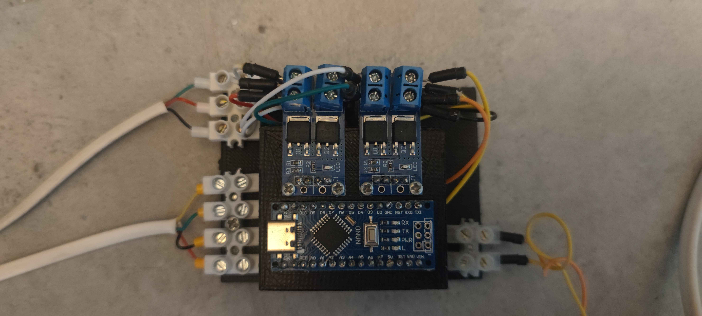
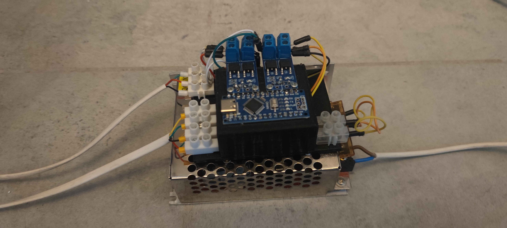
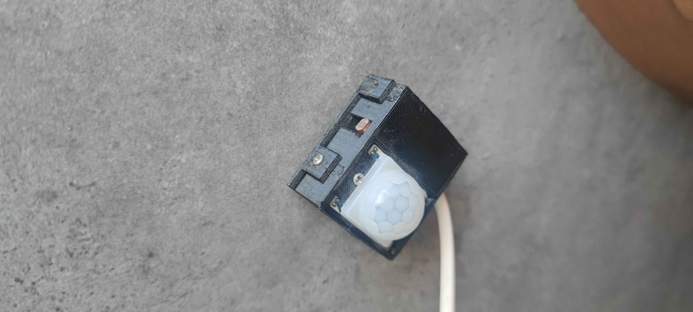
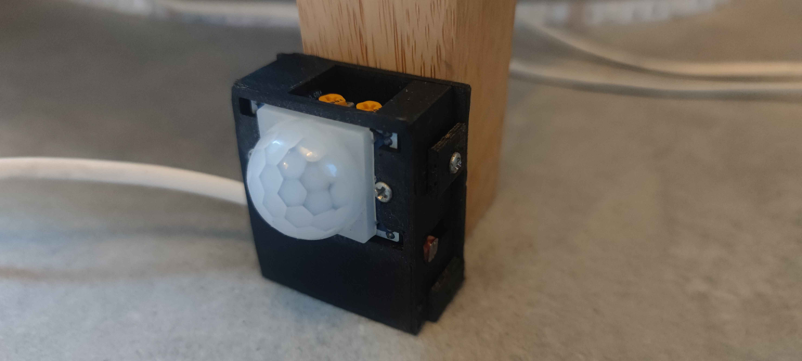
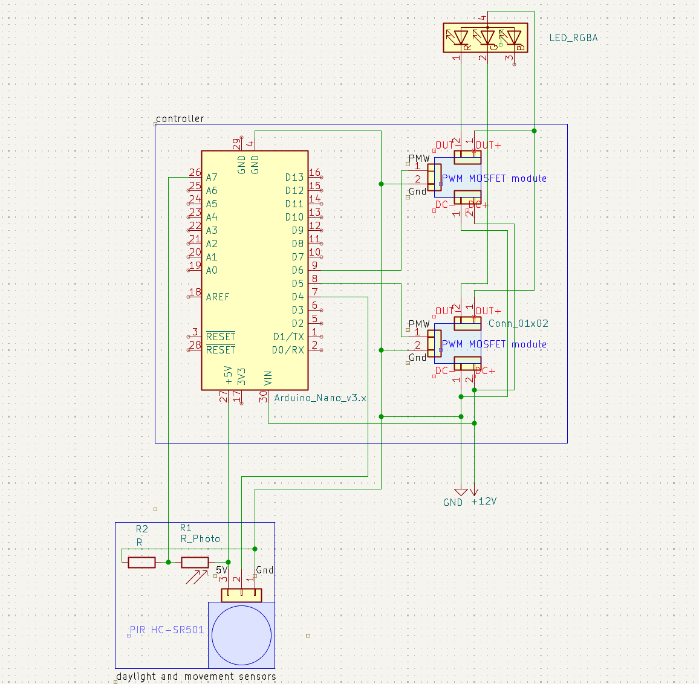
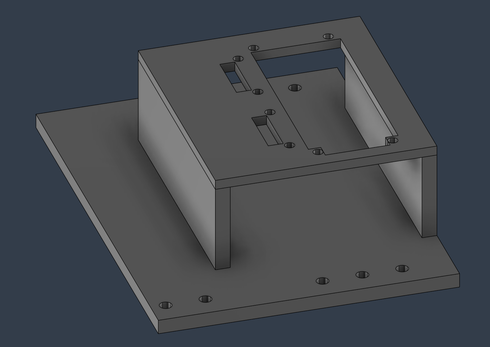
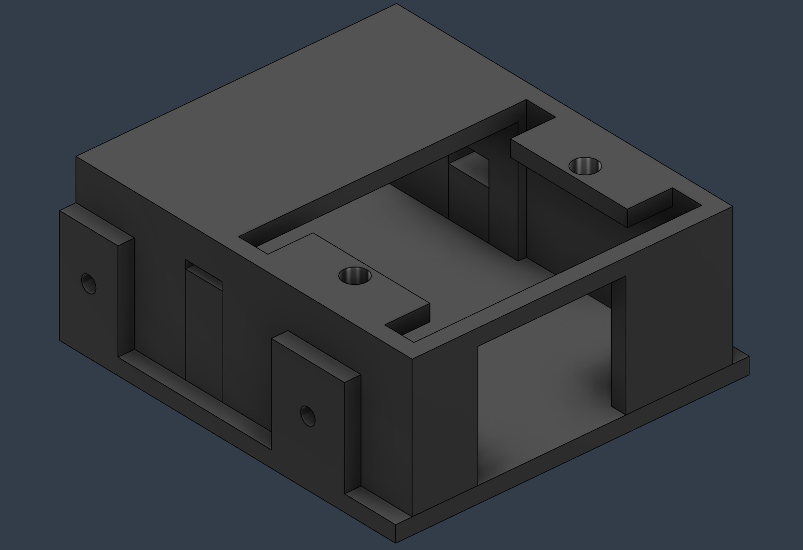
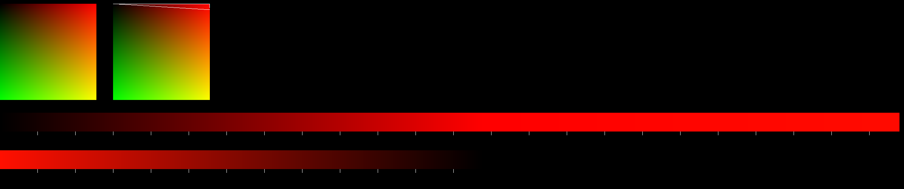

# Smart LED Controller (PIR + Light Sensor)

Intelligent LED lighting controller that automatically turns lights on based on motion detection (PIR) and ambient light level.
This project focuses on embedded system design, sensor integration, and power control using MOSFET, along with a custom 3D enclosure.

---

## 📸 Project Overview

Controller

  
  

Sensors

  
  

  
Presentation

  

---

## ⚙️ Features

* Motion detection using PIR sensor
* Ambient light detection (prevents turning on in bright conditions)
* Red and green LED control using MOSFET
* Slowly fading to warm orage lighting
---

## 🛠 Technologies & Tools

* Electronics: PIR sensor, light sensor, MOSFET driver
* Embedded: Arduino nano 
* Schematic Design: KiCad
* 3D Design: Fusion 360
* Prototyping: breadboard / wiring
* Python: script to simulate color space and fade-in trace

---

## 📐 Hardware Design

###  Electrical Schematic

  

Note:

R2 Resistor determines the input voltage sensitivity. R2 and R1 (photoresistor) are connected in voltage devider configuration such that voltage measured on analog A7 pin can be calculated using this formula:

$$
U_{A7} = 5V \cdot \frac{R_2}{R_1 + R_2}
$$

With considering that formula and measuring the average R1 resistance in day and night, i have choosen the R2 resistor to have the 10k Ohm resistance.  

### 3D Enclosure

Controller stand model

  

Snesors case model

  

---
## Python visualisation
Visualisation of possible color space of red and green leds, fade-in and fade-out time and behavior, using python pygame library.
Each white marker represents 100ms of time passed

  

## 🚀 How It Works

- PIR sensor detects motion; photoresistor checks ambient light  
- LEDs turn ON only if motion is detected and it’s dark  
- Smooth fade-in/out via PWM, maintaining red/green ratio  
- LEDs turn OFF if no motion or environment becomes bright

---

## 🎯 Why I built this

The need for night warm lighting that helps you see what's in the room without having to turn on bright lights.

## 👤 Author
Norbert 
